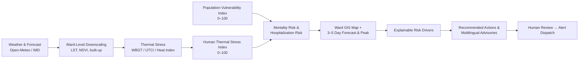
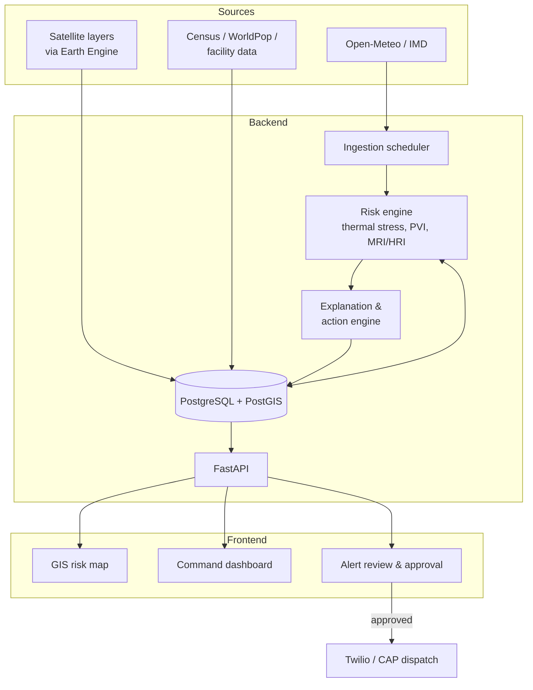

# SMART INDIA HACKATHON 2026
### Problem Statement ID: 26083

# PROJECT PROPOSAL
## Extreme Heatwave Early Warning and Human Thermal Stress Index
*A Hyper-Local Heat-Health Intelligence Platform for Municipal and Disaster Management Authorities*

> "From Temperature to Action: Converting Weather into Localized Health Risk and Decision Support"

---

## 1. Executive Summary

Traditional heatwave warning systems answer a narrow question — will the temperature cross a fixed threshold? — and respond with a single, city-wide message. This misses the reality that identical temperatures produce very different health outcomes depending on humidity, wind, radiant heat, the local built environment, and — critically — who is exposed to them.

This project proposes a hyper-local Heat-Health Early Warning and Decision-Support Platform that converts weather and forecast data into ward-level human thermal stress, adjusts it for each ward's urban heat characteristics using satellite data, combines it with population vulnerability, and produces an explainable, actionable Health Risk classification for every ward in a city. The system does not stop at prediction: it recommends specific interventions (cooling centres, work-hour changes, hospital preparedness, targeted public advisories in local languages) and packages them into ready-to-review alerts for municipal and healthcare authorities.

**Core transformation:** Weather → Ward-Level Heat Exposure → Thermal Stress → Vulnerability → Health Risk → Localized Warning → Recommended Action.

The prototype is built as a transparent, explainable system: every derived score is clearly labeled as a model estimate, every classification can be traced back to its contributing factors, and the underlying formulas and weights are configurable and disclosed rather than presented as black-box or clinically validated predictions. The model is evaluated by replaying a past Indian heatwave and comparing its ward rankings against reported outcomes.

---

## 2. Problem Statement

### 2.1 Background

Extreme heat is among the deadliest climate hazards, yet it is the least dramatically visible — there are no collapsed buildings or floodwaters to photograph, only a slow accumulation of physiological stress that disproportionately affects the elderly, outdoor workers, the urban poor, and those with limited healthcare access. Existing early-warning systems in most cities are built around a single meteorological threshold (e.g., "temperature will exceed 40°C") and issue one undifferentiated warning to the entire population.

### 2.2 Gaps in Current Systems

- Warnings are based largely on air temperature, underweighting humidity, wind, and radiant heat — all of which materially change physiological heat stress.
- Risk is communicated at district or city scale, even though heat exposure varies block-by-block due to differences in vegetation, construction density, and surface materials (the urban heat island effect).
- No distinction is made between environmental severity and who is actually exposed to it — the same weather can be low-risk in one ward and life-threatening in another.
- Warnings are generic ("stay hydrated") rather than targeted to the population segment most at risk (outdoor workers, elderly, informal settlements), and are often not available in the local language.
- Night-time heat and multi-day persistence — two of the strongest drivers of heat mortality — are rarely reflected in the warning itself.
- Authorities receive a forecast, not a decision — they are left to independently determine what action the forecast implies and when to act.

### 2.3 Existing Systems and How This Project Differs

| System | What it does well | What this project adds |
|---|---|---|
| IMD heatwave criteria & warnings | Official, standardized district-level heatwave declarations based on maximum temperature and departure from normal. | Ward-level resolution; humidity, wind, and radiant heat; translation of hazard into population-specific health risk. |
| IMD experimental Heat Index (2024) | Colour-coded "feels-like" guidance combining temperature and humidity. | Adds WBGT/UTCI (radiant heat, wind), vulnerability, and health-system pressure; ward-level rather than station-level. |
| City Heat Action Plans (e.g., Ahmedabad HAP, 2013 onward) | Proven institutional response model — alert levels tied to pre-agreed departmental actions. | Automates the risk-to-action mapping at ward level and prioritizes wards competing for limited resources; designed to plug into an existing HAP rather than replace it. |
| Generic weather apps | Accessible temperature/heat-index forecasts for individuals. | Decision support for authorities: priority wards, recommended interventions, human-reviewed alerts. |

The platform aligns its top-level alert colours with IMD's heatwave warning levels, so that its outputs complement, rather than contradict, official warnings.

### 2.4 The Core Question This Project Answers

> Given the weather conditions that are happening or are expected to happen, what will their likely impact be on human health, which areas and populations are most at risk, when will the risk peak, and what should authorities do about it?

---

## 3. Objectives

- Compute physiologically meaningful heat-stress indicators (WBGT, UTCI, Heat Index) from live and forecast weather data, rather than relying on raw temperature.
- Downscale city-level weather to ward-level heat exposure using satellite land surface temperature, vegetation, and built-up data, so that thermal stress itself — not only vulnerability — varies between wards.
- Combine environmental thermal stress with ward-level population vulnerability (elderly and child population, outdoor-worker density, informal housing, population density, healthcare accessibility) to produce a unified Health Risk classification.
- Localize this risk to the ward level using a GIS-based interface, so authorities can see exactly where intervention is needed rather than treating the city as a single unit.
- Provide a 3–5 day forward-looking forecast of health risk, including night-time heat, multi-day persistence, and identification of the expected peak period.
- Make every risk classification explainable — showing the specific environmental, population, and forecast factors driving the score.
- Automatically translate risk classifications into targeted, actionable recommendations for authorities and audience-specific public advisories in English, Hindi, and the pilot city's regional language.
- Go beyond outdoor temperature warnings: estimate indoor heat risk in heat-trapping housing, express forecasts as alert probabilities, give outdoor workers hour-by-hour safe work windows, identify "cooling deserts," let planners test interventions before funding them, and learn from health-worker reports each season.
- Evaluate the model against a past heatwave event and report its accuracy and limitations openly.
- Maintain full transparency about data provenance — clearly distinguishing live data, static/census data, satellite-derived data, and model estimates at every point in the interface.

---

## 4. Proposed Solution

### 4.1 Conceptual Pipeline

The system is built around a single computational spine through which every module operates. Rather than being a collection of disconnected features, every part of the platform exists to feed the next stage of this pipeline:

### 4.2 The Central Differentiator

Two wards can report an identical 41°C forecast and still deserve entirely different risk classifications. A ward with 35% relative humidity, dense tree cover, a young population, and few outdoor workers is far less dangerous than a ward with 75% humidity, dense concrete construction that stays hot through the night, a large elderly population, high outdoor-worker density, and poor healthcare access. The platform is explicitly designed to make this distinction, moving decision-making away from "will it be hot" and toward "who will be harmed, where, and when."

### 4.3 Pilot City

The prototype will be demonstrated on one pilot city with 15–25 selected wards. The pilot city is chosen against four criteria:

1. Publicly available ward boundary data (GeoJSON/shapefile).
2. A documented history of severe heatwaves with reported health impact.
3. An existing Heat Action Plan to align with and compare against.
4. Availability of at least a few ground weather stations (IMD AWS or CPCB monitoring stations) for validating the downscaling step.

**Recommended pilot: Ahmedabad** (Gujarat) — it meets all four criteria, and its Heat Action Plan provides a real-world benchmark for the recommended actions. Nagpur and Delhi are fallback options. Because the methodology depends only on weather, boundary, census, and satellite data, it transfers to any other Indian city.

### 4.4 Primary and Secondary Users

The platform serves two roles from one shared underlying data model, differing only in what is foregrounded by default:

- **Municipal / Disaster Management Authority (primary)** — city-wide status, GIS risk map defaulting to the Mortality Risk layer, priority-ward rankings, and an action dashboard covering cooling centres, work-hour policy, and public warnings.
- **Healthcare Administrator (secondary)** — the same map defaulting to the Hospital Risk layer, wards re-ranked by healthcare pressure, and an action dashboard covering hospital alerts, ambulance readiness, and emergency-department preparedness.

### 4.5 Key Innovations

Six innovations set this platform apart from a conventional heat-index dashboard. Each reuses the same core scoring engine, so they add depth without adding a separate system.

| # | Innovation | What it does | Why it matters |
|---|---|---|---|
| 1 | **Indoor Heat Risk from Housing Type** | Uses Census roof-material data (metal/asbestos sheet vs. concrete) to estimate how much hotter homes in each ward become than outdoor air, especially at night. | Most heat deaths occur indoors, yet almost every warning system models only outdoor air. This is an India-specific insight built on data that already exists. |
| 2 | **Probabilistic Alerts** | Runs the full risk pipeline on every member of an ensemble weather forecast, reporting "70% chance Ward 14 reaches Red on Thursday" rather than a single yes/no. | Lets authorities act early when confidence is high and hold back when it is low — directly reducing false alarms. |
| 3 | **What-If Intervention Simulator** | Recomputes ward risk under hypothetical changes: a new cooling centre, added tree cover, cool-roof coatings. | Turns the platform from a warning tool into a planning tool for long-term heat-resilience investment. |
| 4 | **Safe Work Windows** | Converts hourly WBGT into ward-specific safe working hours and work/rest ratios for light, moderate, and heavy outdoor work. | Replaces vague "avoid midday work" advice with an exact schedule contractors, sanitation crews, and worksite supervisors can follow. |
| 5 | **Cooling-Desert Mapping** | Computes walking-time access from vulnerable populations to cooling centres, drinking-water points, shaded spaces, and health facilities; proposes optimal new cooling-centre sites. | Grounds resource allocation in real accessibility rather than a generic score. |
| 6 | **Health-Worker Feedback Loop** | ASHA workers and PHC staff report suspected heat-illness cases through a minimal form; the platform flags wards where reports outpace predictions and recalibrates weights after each season. | Provides real-time ground truth and makes the model improve every summer. |

Two further additions extend reach and accountability: **voice (IVR) alerts in local languages** for people who cannot read SMS, and an automatic **post-event report card** comparing predicted risk against reported outcomes after each heatwave.

---

## 5. Functional Modules

The platform is one integrated system; the following are its functional components, not separate applications:

| Module | Function |
|---|---|
| Weather & Forecast Data | Live conditions and 3–5 day hourly forecasts: temperature, humidity, wind, shortwave radiation, pressure, dew point, cloud cover. |
| Geographic / Ward Data | City → Zone → Ward boundaries enabling hyper-local (not city-wide) risk representation. |
| Urban Heat Downscaling | Adjusts grid-level weather to each ward using satellite land surface temperature, vegetation (NDVI), and built-up density. |
| Population Vulnerability | Elderly and child population, outdoor-worker density, informal housing, population density, healthcare accessibility per ward. |
| Thermal Stress Calculation | WBGT, UTCI, and Heat Index computed from ward-adjusted weather variables. |
| Human Thermal Stress Index | Unified 0–100 stress score combining the three indicators, night-time heat, persistence, and indoor heat. |
| Indoor Heat Estimator | Estimates additional indoor heat load per ward from the share of heat-trapping roofs (metal/asbestos sheet). |
| Mortality Risk Index | Thermal stress × vulnerability × historical illness factor → 0–100 health-danger score. |
| Hospitalization Risk Index | Thermal stress × vulnerability × healthcare capacity factor → 0–100 system-pressure score. |
| 3–5 Day Forecast Engine | Projects thermal stress and risk scores forward; identifies expected peak day/time and heatwave events. |
| Ensemble Probability Engine | Runs the risk pipeline on every ensemble forecast member to give the probability of each alert level per ward per day. |
| GIS Risk Map | Ward-coloured map with switchable layers (temperature, thermal stress, vulnerability, mortality risk, hospital risk, recommended actions). |
| Ward Detail Panel | Full drill-down view of a single ward's weather, indices, population, risk, and forecast. |
| Risk Explanation Engine | Ranked, weighted breakdown of the environmental, population, health, and forecast factors driving a ward's classification. |
| Alert Engine | Converts a risk classification crossing a threshold into a structured, human-reviewed alert. |
| Public Advisory Generator | Audience-specific messages (general public, outdoor workers, elderly/vulnerable groups) in English, Hindi, and the regional language. |
| Action Recommendation Engine | Maps specific risk drivers to specific interventions (e.g., high outdoor-worker vulnerability → shift work hours). |
| Safe Work Window Planner | Hourly WBGT → safe working hours and work/rest ratios by workload, per ward. |
| Cooling Access Analyzer | Walking-time access to cooling options; identifies cooling deserts and optimal new cooling-centre sites. |
| Resource Allocation Engine | Ranks and sequences interventions across wards competing for the same limited resources (e.g., cooling units, ambulances). |
| What-If Scenario Simulator | Recomputes ward risk under hypothetical interventions (cooling centres, tree cover, cool roofs). |
| Notification / Alert Delivery Layer | Simulated SMS / WhatsApp / IVR voice / API dispatch, gated by human review and approval. |
| Health-Worker Reporting | Minimal case-report form for ASHA/PHC staff; anomaly flags and post-season recalibration. |
| Post-Event Report Card | Automatic comparison of predicted risk against reported outcomes after each heatwave. |
| City-Wide Command Dashboard | Aggregate status, priority wards, heatwave event tracking, and prioritized interventions for the authority. |

---

## 6. Thermal Stress and Risk Scoring Logic

All weights and thresholds below are initial, literature-informed defaults. They are stored in a configuration file, shown in the interface, and adjustable by the authority; they are not presented as clinically calibrated values.

### 6.1 Ward-Level Heat Exposure (Downscaling)

Public forecast models provide weather on grids several kilometres wide, so most wards in a city receive nearly identical raw forecasts. To make thermal stress genuinely ward-specific, each ward's air temperature and radiant load are adjusted using satellite data processed in advance (Google Earth Engine):

- **Land Surface Temperature (LST)** — Landsat 8/9 thermal band (30 m after resampling) and MODIS (1 km, daily) summer composites, giving each ward's typical heat anomaly relative to the city mean.
- **Vegetation (NDVI)** — Sentinel-2 (10 m), indicating shade and evaporative cooling.
- **Built-up density** — ESA WorldCover / GHSL, indicating heat retention, especially at night.

Ward-adjusted air temperature is estimated as:

> T_ward = T_grid + β × (LST_ward − LST_city)

where β (the fraction of the surface temperature anomaly that appears in air temperature) is fitted against available ground stations in the pilot city, with a literature-based default of about 0.3 where station data is insufficient. Ward-level mean radiant temperature is similarly adjusted downward for tree cover. These adjusted values are labeled **Derived** in the interface.

### 6.2 Thermal Stress Indicators

Three complementary indicators are computed hourly from ward-adjusted weather, each capturing a different aspect of environmental heat stress:

| Indicator | What it captures | Computation method |
|---|---|---|
| **UTCI** (Universal Thermal Climate Index) | Whole-body human thermal stress from temperature, humidity, wind, and radiant heat. | Polynomial approximation (Bröde et al., 2012); mean radiant temperature derived from shortwave radiation and solar geometry. |
| **WBGT** (Wet-Bulb Globe Temperature) | Occupational / outdoor-work heat stress; the standard for work-rest guidance. | Liljegren et al. (2008) physical model estimating natural wet-bulb and globe temperature from standard weather variables. |
| **Heat Index** | Combined effect of temperature and humidity; the most familiar public-facing measure. | NWS Rothfusz regression with standard adjustments. |

Implementation uses established open-source libraries (`pythermalcomfort`, ECMWF `thermofeel`), cross-checked against each other on test cases.

### 6.3 Human Thermal Stress Index (HTSI, 0–100)

Each indicator is mapped to 0–100 using linear interpolation between its recognized "no stress" and "extreme stress" thresholds:

| Indicator | Maps to 0 at | Maps to 100 at | Basis |
|---|---|---|---|
| UTCI | 26°C | 46°C | UTCI stress categories (moderate → extreme) |
| WBGT | 25°C | 33°C | Occupational heat-stress guidance ranges |
| Heat Index | 27°C | 54°C | NWS caution → extreme danger bands |

The daily HTSI for a ward combines these with two mortality-relevant modifiers:

> HTSI = min(100, [0.5 × UTCI_n + 0.3 × WBGT_n + 0.2 × HI_n] + P_night + P_persist + P_indoor)

- **P_night** (0–10): added when the night-time minimum stays high (e.g., ward-adjusted Tmin ≥ 28°C), since lack of overnight recovery is a key mortality driver.
- **P_persist** (0–10): added for each consecutive day above the High category, capturing cumulative heat load.
- **P_indoor** (0–10) — *Innovation 1*: equal to 10 × R_ward, where R_ward is the share of households in the ward with heat-trapping roofs (metal, asbestos, or other sheet roofing, per Census houselisting data). Applied only on days when the base score reaches High (≥ 41), and scaled up when P_night is also active, because sheet-roofed homes release stored heat slowly overnight. Labeled as a model estimate.

Categories: Low (0–20), Moderate (21–40), High (41–60), Very High (61–80), Extreme (81–100).

### 6.4 Population Vulnerability Index (PVI, 0–100)

Computed per ward as a weighted sum of indicators, each min-max normalized across the city's wards:

| Indicator | Default weight | Source |
|---|---|---|
| Elderly share (60+) | 0.25 | Census / WorldPop age structure |
| Outdoor-worker share | 0.20 | NSSO / PLFS, disaggregated |
| Healthcare access (inverse distance/time to nearest facility) | 0.20 | Health facility registry, OSM |
| Informal housing / slum share | 0.15 | Census slum data, municipal records |
| Children under 5 | 0.10 | Census / WorldPop |
| Population density | 0.10 | WorldPop (100 m) |

Vulnerability is treated as relatively static and is recomputed only when source data changes.

### 6.5 Mortality Risk vs. Hospitalization Risk

Both indices share two inputs — HTSI and PVI — but diverge on a third, giving each a distinct purpose:

> Mortality Risk Index (MRI) = min(100, HTSI × (0.4 + 0.6 × PVI/100) × H_m)
>
> Hospitalization Risk Index (HRI) = min(100, HTSI × (0.4 + 0.6 × PVI/100) × C_h)

- The vulnerability term scales risk between 40% and 100% of thermal stress, so risk is always zero when there is no heat stress, and even the least vulnerable ward is not treated as risk-free.
- **H_m** (historical illness factor, 0.8–1.2) — reflects past heat-related illness/mortality in the ward or district relative to the city average; defaults to 1.0 where data is unavailable. MRI answers "how dangerous is this to life," and drives public warnings, cooling centres, and welfare checks.
- **C_h** (capacity-pressure factor, 0.8–1.3) — reflects population per hospital bed and emergency-department capacity near the ward relative to the city median. HRI answers "how much pressure will this place on the health system," and drives hospital alerts and ambulance readiness.

### 6.6 Alert Levels

Ward risk scores map to four alert levels whose colours match IMD's warning scheme, so authority users see a familiar vocabulary:

| MRI / HRI | Alert level | Example trigger actions |
|---|---|---|
| 0–40 | Green — No action | Routine monitoring. |
| 41–60 | Yellow — Be aware | Public advisory; hospitals notified. |
| 61–80 | Orange — Be prepared | Cooling centres opened; outdoor work hours shifted; ambulances pre-positioned. |
| 81–100 | Red — Take action | Welfare checks for elderly; emergency-department surge mode; targeted SMS alerts. |

### 6.7 Explainability

Every risk score is accompanied by a ranked, weighted breakdown of contributing factors rather than a flat checklist. Because the scoring functions are additive and multiplicative with known weights, each factor's contribution can be computed exactly (not approximated), so the one or two most significant drivers (for example, high elderly population, or four-day heat persistence) are clearly distinguished from minor contributors. This is essential for authority trust and for prioritizing which intervention will have the greatest effect.

### 6.8 Transparency Principle

The prototype does not claim clinically validated mortality prediction. Every derived score is labeled in the interface as a model estimate alongside the score itself (not only in a separate disclosure panel), and the underlying formulas, thresholds, and weights are configurable and disclosed rather than fixed or hidden. Data source status (Live, Static/Census, Satellite-Derived, Historical, Model Estimate) is shown for every category of information presented.

### 6.9 Forecast Confidence — Probabilistic Alerts (Innovation 2)

Open-Meteo's Ensemble API provides multiple equally plausible forecast runs (tens of members from the ECMWF and GFS ensembles). The full pipeline — downscaling, thermal stress, HTSI, MRI/HRI — runs once per member. For each ward and day:

> P(alert ≥ level) = (number of members where MRI reaches that level) ÷ (total members)

The map shows the most likely alert level with a confidence indicator, and alert triggers can be configured on probability (e.g., "raise Orange preparedness when P(Red) ≥ 40% at 3-day lead time"). Forecast reliability is checked in the backtest (§9).

### 6.10 Safe Work Windows (Innovation 4)

For every ward and hour, WBGT is compared against occupational heat-stress thresholds (ACGIH TLV / ISO 7243 guidance) for light, moderate, and heavy work, yielding one of: continuous work permitted, a recommended work/rest ratio, or work not advised. Output is a per-ward schedule such as *"Thursday, Ward 7 — heavy work not advised 11:00–16:30; 45 min rest per hour 10:00–11:00."* Thresholds are stored in configuration and cited in the interface; the planner assumes acclimatized workers by default, with a stricter unacclimatized option for the first days of a heatwave.

### 6.11 Cooling Access and Cooling Deserts (Innovation 5)

Cooling options (designated cooling centres, drinking-water points, shaded parks, public buildings, and health facilities) are mapped from municipal lists and OpenStreetMap. Walking-time zones (default 15 minutes) are computed with the open-source OSRM routing engine. For each ward:

> Cooling Gap = share of PVI-weighted population (WorldPop 100 m cells) beyond the walking threshold of any cooling option

Wards with a high Cooling Gap are flagged as **cooling deserts**. The Resource Allocation Engine then selects the best sites for *k* new cooling centres from candidate public buildings (schools, community halls) using a greedy maximum-coverage algorithm that maximizes vulnerable population newly brought within reach.

### 6.12 What-If Scenarios (Innovation 3)

Because every step of the model is an explicit function, scenario inputs can be changed and the pipeline re-run instantly:

| Scenario lever | How it changes the model |
|---|---|
| Add tree cover (%) | Raises ward NDVI → lowers LST anomaly via the LST–NDVI relationship fitted in downscaling → lowers ward air temperature and mean radiant temperature. |
| Cool roofs on X% of sheet-roofed homes | Reduces effective R_ward → lowers P_indoor. |
| Open a cooling centre at a location | Recomputes Cooling Gap and healthcare/cooling access → lowers PVI. |
| Add hospital beds / ambulances | Adjusts capacity-pressure factor C_h → lowers HRI. |

Results show before/after risk for each affected ward over a replayed heatwave and are labeled **Scenario Estimate**.

### 6.13 Health-Worker Feedback and Recalibration (Innovation 6)

ASHA workers and PHC staff submit a minimal report per suspected heat-illness case: ward, date, age band, symptom severity, and outcome (treated / referred / died). No names or personal identifiers are collected, in line with the Digital Personal Data Protection Act, 2023.

- **During an event:** daily reported cases per ward are compared with the count expected from its MRI; wards where reports significantly exceed expectation are flagged for immediate attention, even if their modeled risk is lower.
- **After each season:** the historical illness factor H_m for each ward is re-estimated from accumulated reports, and weight adjustments are proposed (not auto-applied) for authority review.

---

## 7. Datasets and APIs

### 7.1 Weather and Forecast Data
- **Open-Meteo** — free, key-free API providing current conditions and hourly multi-day forecasts (temperature, humidity, wind, shortwave radiation, pressure, dew point, cloud cover); primary source for the prototype.
- **India Meteorological Department (IMD)** — official heatwave warnings and observed station data; used for alignment and validation.
- **Open-Meteo Ensemble API** — multi-member ensemble forecasts used for probabilistic alerts.
- **OpenWeatherMap API** — backup source for current and forecast conditions.
- **NASA POWER API** — supplementary solar radiation and historical meteorological data.
- **ERA5 (Copernicus Climate Data Store)** — historical reanalysis data for backtesting.

### 7.2 Satellite and Land-Cover Data (Urban Heat Downscaling)
- **Landsat 8/9** (USGS) — land surface temperature.
- **MODIS LST** (NASA) — daily land surface temperature, day and night.
- **Sentinel-2** (ESA Copernicus) — NDVI vegetation index.
- **ESA WorldCover / GHSL** — built-up area and land cover.
- All processed via **Google Earth Engine** into per-ward summer composites.

### 7.3 Geographic / Ward Boundary Data
- Municipal Corporation GIS portals of the pilot city (ward-level shapefiles/GeoJSON).
- **data.gov.in** — administrative boundaries.
- **DataMeet** — community-maintained Indian boundary shapefiles, used as a fallback.

### 7.4 Population and Vulnerability Data
- **Census of India (2011)** — ward-level demographic structure, age distribution, slum population; to be replaced by the upcoming census when released.
- **Census of India Houselisting & Housing tables** — predominant roof material (e.g., metal/asbestos sheet, concrete) per household, used for the indoor heat estimate.
- **WorldPop** — 100 m gridded population and age-structure estimates for recent years, used to update the 2011 figures.
- **NSSO / Periodic Labour Force Survey (PLFS)** — occupational and informal-sector employment, as a proxy for outdoor-worker density.
- **National Family Health Survey (NFHS-5)** — health-access and vulnerability indicators.

### 7.5 Historical Health Data
- **NCDC — National Programme on Climate Change and Human Health (NPCCHH)** heat-related illness and death surveillance reports.
- **NDMA Heat Action Plan reports** — past-event impact summaries by state/city.
- State/city health department bulletins from prior heatwave events, used for backtesting.

### 7.6 Healthcare Facility Data
- **Health Facility Registry (Ayushman Bharat Digital Mission)** — hospital/clinic locations and capacity, where available.
- **OpenStreetMap (via Overpass API)** — fallback facility locations, plus drinking-water points, parks, schools, and community halls for cooling-access analysis.
- **Municipal cooling-centre / Heat Action Plan lists** — designated cooling centres and water kiosks where published.
- **OSRM (Open Source Routing Machine)** — walking-time calculations on the OpenStreetMap road network.

### 7.7 Language and Alert Delivery (Simulated in Prototype)
- **Bhashini** (Government of India language platform) — translation support for advisories, with pre-translated, human-verified templates for the core messages.
- **Twilio API** — SMS/WhatsApp sandbox and Programmable Voice (IVR) for demonstrating text and voice alert dispatch without live delivery costs.
- Government mass-notification systems (e.g., NDMA Sachet, which uses the Common Alerting Protocol) as a future integration point; the platform emits alerts in CAP-compatible format so this integration is straightforward.

> **Note:** Ward-level granularity for outdoor-worker density, healthcare accessibility, and historical health outcomes is not fully available in public datasets. Where this is the case, the prototype uses transparent, clearly documented estimation methods (e.g., disaggregating district-level statistics by WorldPop population share) rather than presenting estimates as measured data.

---

## 8. Technical Architecture

### 8.1 Technology Stack

| Layer | Technology | Purpose |
|---|---|---|
| Data ingestion & scheduling | Python, APScheduler | Hourly weather pulls; daily forecast refresh. |
| Satellite preprocessing | Google Earth Engine (Python API) | Ward-level LST, NDVI, built-up composites (run offline, stored as static layers). |
| Scientific computation | NumPy, pandas, `pythermalcomfort`, `thermofeel` | WBGT, UTCI, Heat Index, indices, ensemble runs, scenarios. |
| Routing & accessibility | OSRM (Docker), GeoPandas | Walking-time zones, cooling-desert analysis, site selection. |
| Backend API | FastAPI | Serves ward scores, forecasts, explanations, alerts. |
| Database | PostgreSQL + PostGIS | Ward geometries, time-series scores, alert audit log. |
| Frontend | React + MapLibre GL / Leaflet, Recharts | GIS risk map, dashboards, forecast charts. |
| Alerts | Twilio sandbox (SMS, WhatsApp, Voice), CAP XML output | Simulated delivery after human approval. |
| Field reporting | Mobile-friendly web form (+ WhatsApp flow) | Health-worker case reports. |
| Deployment | Docker Compose | One-command local or cloud deployment. |

### 8.2 System Architecture

### 8.3 Scalability and Cost

The prototype runs entirely on free data sources and free-tier or open-source software. Computation is light: for a city of ~200 wards, the full hourly pipeline completes in seconds on a single small server. Satellite composites are computed once per season, not per request. Adding a new city requires only its ward boundaries and census mapping; the scoring engine is unchanged.

---

## 9. Validation and Evaluation

The model is evaluated rather than only demonstrated.

### 9.1 Historical Backtest
Replay a past severe heatwave in the pilot city (or a comparable event such as the 2024 North India heatwave) using ERA5 reanalysis weather in place of forecasts, and compare model outputs against:

- **IMD heatwave declarations** — did the model reach Orange/Red on the days IMD declared heatwave or severe heatwave conditions? (hit rate, false-alarm rate, lead time)
- **Reported heat-related illness/deaths** — do wards or districts ranked higher-risk correspond to those with more reported cases? (Spearman rank correlation, where data permits)

### 9.2 Downscaling Check
Compare ward-adjusted temperatures against available ground stations (IMD AWS, CPCB stations) not used in fitting β; report mean absolute error before and after downscaling.

### 9.3 Sensitivity Analysis
Vary each weight by ±20% and report how much ward rankings change. Rankings that stay stable build confidence; unstable ones are flagged as needing local calibration.

### 9.4 Forecast Reliability
For the probabilistic alerts, compare forecast probabilities against what actually occurred over the backtest period (Brier score and a reliability diagram): when the model says 70%, the event should happen roughly 70% of the time.

### 9.5 Post-Event Report Card
After each heatwave (and for the backtest event in the prototype), the platform automatically produces a one-page report: predicted vs. reported outcomes per ward, alert lead times, missed and false alerts, and health-worker report anomalies. This is published to authorities as an accountability and learning tool.

### 9.6 Success Criteria for the Prototype
- The end-to-end pipeline runs automatically for all demo wards, hourly.
- Ward-to-ward differences in thermal stress are visible and traceable to satellite, housing, and vulnerability inputs.
- The backtest shows the model raising alerts on or before IMD-declared heatwave days.
- Every score on screen can be explained in terms of its top contributing factors.
- Each of the six innovations is demonstrable end-to-end in the demo.

---

## 10. Phased Development Plan

Development is sequenced to prove the core weather-to-risk calculation first — and test it against a real past heatwave — before investing in map, dashboard, or alerting UI. This de-risks the most scientifically scrutinized part of the project early. Detailed task lists for each phase are in the [`phases/`](phases/README.md) folder.

| Phase | Focus | Key Deliverables | Exit Criteria |
|---|---|---|---|
| Phase 0 | Foundation & Data Freeze | Pilot city and demo wards confirmed; boundaries, census (incl. roof material), WorldPop, facilities, and cooling points compiled into one ward table; formulas and weights in `config.yaml`. | Frozen ward dataset and reviewed config committed. |
| Phase 1 | Core Scoring Library | `heatrisk` Python package: weather → WBGT/UTCI/HI → HTSI (incl. indoor heat) → PVI → MRI/HRI → explanation, for one ward. | Two-library cross-check within tolerance; unit tests pass. |
| Phase 2 | Urban Heat Downscaling | Earth Engine LST/NDVI/built-up per ward; β fitted against ground stations; LST–NDVI relationship stored for scenarios. | Downscaling error reported against held-out stations. |
| Phase 3 | Multi-Ward Scoring & Backtest | All wards scored; ERA5 replay of a past heatwave; weight tuning; sensitivity analysis. | Model raises alerts on/before IMD heatwave days; rankings stable under ±20% weights. |
| Phase 4 | Forecast & Ensemble Probabilities | 3–5 day trajectories, persistence, peak detection, heatwave events; ensemble runs → alert probabilities. | Probabilities per ward/day; reliability checked on backtest period. |
| Phase 5 | API & GIS Map | FastAPI service, scheduler, database; ward map with layers, probability display, drill-down panel. | All wards update hourly and render on the map. |
| Phase 6 | Decision Layer | Action rules, priority ranking, safe work windows, cooling-desert analysis and site selection, multilingual advisories. | Every alert level yields ward-specific actions, work schedules, and advisories in three languages. |
| Phase 7 | Command Dashboard & Alert Delivery | Authority dashboard, human review/approval, CAP output, simulated SMS/WhatsApp/IVR voice dispatch, audit log. | Trigger → review → approval → dispatch works end-to-end with audit trail. |
| Phase 8 | What-If Simulator & Feedback Loop | Scenario simulator; health-worker reporting form, anomaly flags, recalibration proposal. | Scenarios show before/after risk; reports raise flags on the dashboard. |
| Phase 9 | Validation, Polish & Demo | Final evaluation, post-event report card, data-source labels, UX polish, scripted demo. | Evaluation documented; all innovations demonstrable in a rehearsed demo. |

---

## 11. Feasibility and Viability

### 11.1 Technical Feasibility

All required weather and forecast inputs are available through free, key-free or low-friction APIs (Open-Meteo, NASA POWER). WBGT, UTCI, and Heat Index are established, published formulas with maintained open-source implementations. Satellite layers are freely available and can be processed in Google Earth Engine at no cost for research use. Ward boundary and census demographic data are publicly available for most major Indian cities, with documented fallback strategies where granularity is limited.

### 11.2 Data Limitations and Mitigation

| Limitation | Mitigation |
|---|---|
| Forecast grids are coarser than wards. | Satellite-based downscaling (§6.1), validated against ground stations and labeled as derived. |
| 2011 Census is outdated. | Update population and age structure with WorldPop; swap in the new census when released. |
| No ward-level outdoor-worker or health-outcome data. | Disaggregate district statistics by population share; label as estimates; default historical factor to 1.0 where missing. |
| Few historical health records for calibration. | Frame outputs as relative risk rankings for prioritization, not absolute case predictions; report sensitivity analysis; build up ground truth through the health-worker feedback loop. |
| Roof-material data may not be published at ward level. | Use the finest published level (town/ward where available) and disaggregate using slum and built-up data; label as estimate. |
| Health reports are sensitive data. | Collect no personal identifiers; store only aggregated counts per ward and day; restrict access by role. |

The prototype is framed explicitly as a decision-support and demonstration system rather than a clinically validated predictive model — consistent with the transparency principle embedded throughout the platform design.

### 11.3 Operational Viability

The human-in-the-loop alert approval step ensures the system supports, rather than replaces, authority judgment — reducing false-alarm risk and aligning with how real disaster-management workflows operate. Alert levels mirror IMD colours and plug into existing Heat Action Plan responsibilities, so authorities do not need to learn a new vocabulary. The modular architecture allows individual components (e.g., the risk-scoring weights, or a new data source) to be recalibrated independently as better data becomes available post-prototype.

---

## 12. Expected Outcomes and Impact

- A working demonstration of ward-level, physiologically grounded heat-health risk assessment — moving beyond "will it be hot" to "who is at risk, where, and when."
- A GIS-based decision-support interface enabling municipal and health authorities to prioritize limited resources (cooling centres, hospital readiness, targeted warnings) toward the wards and populations that need them most.
- A 3–5 day forward-looking view of health risk, including night-time heat and persistence, allowing preventive action before peak heat rather than reactive response after it.
- Multilingual, audience-specific advisories — by text and voice — that reach outdoor workers, the elderly, and informal settlements in their own language.
- Recognition of indoor heat in informal housing, probabilistic alerts, hour-by-hour safe work schedules, and cooling-desert maps — capabilities not offered by existing heat warning systems.
- A planning tool that lets authorities test tree planting, cool roofs, and cooling-centre placement before committing budgets.
- A system that learns: health-worker reports and post-event report cards improve the model every season.
- A transparent, explainable, and evaluated model architecture that can be incrementally calibrated with real historical health data as it becomes available through institutional partnerships.
- A template applicable beyond the pilot city — the ward-based methodology generalizes to any Indian city with basic weather, boundary, census, and satellite data.

---

## 13. Team

| Member | Role | Responsibilities |
|---|---|---|
| *[Name]* | Team Lead / Data Scientist | Scoring model, validation, weight configuration. |
| *[Name]* | Geospatial Engineer | Ward boundaries, Earth Engine downscaling, PostGIS. |
| *[Name]* | Backend Engineer | Ingestion, FastAPI, risk engine, alert workflow. |
| *[Name]* | Frontend Engineer | GIS map, dashboards, forecast charts. |
| *[Name]* | UX & Communication | Advisory templates, translations, authority-facing interface design. |
| *[Name]* | Domain & Research | Public-health literature, Heat Action Plan alignment, documentation. |

---

## 14. Summary Definition

> A hyper-local heat-health intelligence platform that converts weather forecasts into ward-level human thermal stress, population vulnerability, mortality and hospitalization risk, and then converts those predictions into targeted, multilingual alerts and actionable interventions for authorities.

---

## 15. References

1. Bröde, P., et al. (2012). Deriving the operational procedure for the Universal Thermal Climate Index (UTCI). *International Journal of Biometeorology*, 56(3), 481–494.
2. Liljegren, J. C., et al. (2008). Modeling the wet bulb globe temperature using standard meteorological measurements. *Journal of Occupational and Environmental Hygiene*, 5(10), 645–655.
3. Rothfusz, L. P. (1990). *The Heat Index Equation.* NWS Technical Attachment SR 90-23.
4. India Meteorological Department. Heat wave criteria and warning services.
5. National Disaster Management Authority (2019). *Guidelines for Preparation of Action Plan – Prevention and Management of Heat Wave.*
6. Ahmedabad Municipal Corporation. *Ahmedabad Heat Action Plan.*
7. National Centre for Disease Control. *National Action Plan on Heat Related Illnesses* (NPCCHH).
8. ISO 7243:2017. *Ergonomics of the thermal environment — Assessment of heat stress using the WBGT index.*
9. ACGIH. *Heat Stress and Strain: TLV® Documentation.*
10. Tartarini, F., & Schiavon, S. (2020). pythermalcomfort: A Python package for thermal comfort research. *SoftwareX*, 12, 100578.

