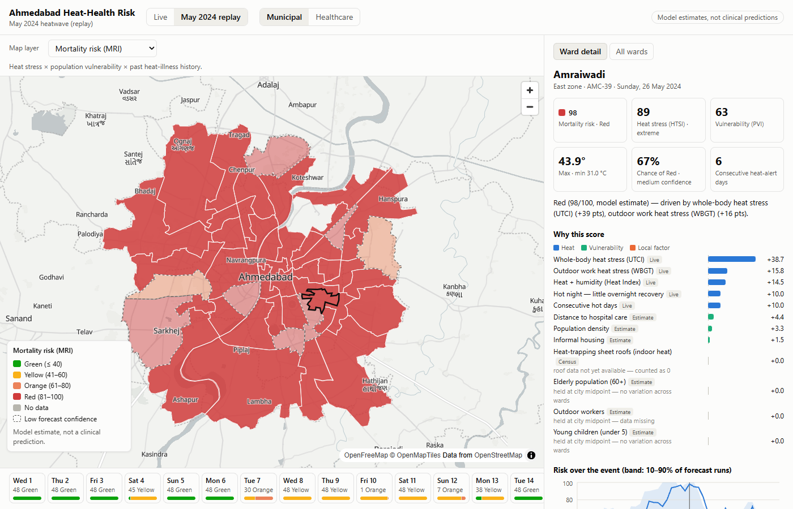

# Project Status Report — Heat-Health Early Warning Platform

SIH 2026 · Problem Statement 26083 · Pilot city: **Ahmedabad** (48 wards)
Status as of **25 September 2026**. Phases 0, 1 and 2 are done. Phases 3, 4 and 5 are complete. Phases 6–9 have not started.

This report explains everything built so far: what the platform is meant to do, what data was collected and where it came from, how each score is calculated, what was tested, what problems were found, and what is still missing.

---

## Contents

1. [What the platform does](#1-what-the-platform-does)
2. [Overall progress](#2-overall-progress)
3. [Phase 0 — Data collection](#3-phase-0--data-collection-and-data-freeze)
4. [Phase 1 — Scoring library](#4-phase-1--core-scoring-library)
5. [Phase 2 — Ward-level downscaling](#5-phase-2--ward-level-downscaling)
   - [Phase 3 — Calibration and backtest](#5b-phase-3--calibration-and-backtest)
   - [Phase 4 — Forecasts and probabilistic alerts](#5c-phase-4--forecasts-and-probabilistic-alerts)
   - [Phase 5 — API and ward map](#5d-phase-5--api-and-ward-map)
6. [Tests](#6-tests)
7. [Real-data results so far](#7-real-data-results-so-far)
8. [Known problems and open questions](#8-known-problems-and-open-questions)
9. [What is still missing (data)](#9-what-is-still-missing-data)
10. [Next steps](#10-next-steps)
11. [How to run everything](#11-how-to-run-everything)
12. [File map](#12-file-map)

---

## 1. What the platform does

City heat alerts today are usually issued for a whole city from one weather station. This platform aims to give **each ward its own heat-health risk score and alert**, and then turn that into specific actions for authorities.

The chain from weather to action:

```
Weather forecast (Open-Meteo)
   │
   ▼
Ward-level adjustment (satellite surface temperature)       ← Phase 2
   │
   ▼
Thermal stress: UTCI, WBGT, Heat Index                       ← Phase 1
   │
   ▼
HTSI  — Human Thermal Stress Index (0–100)                   ← Phase 1
   │        + hot nights, consecutive hot days, sheet roofs
   ▼
PVI   — Population Vulnerability Index (0–100)               ← Phase 1
   │        elderly, children, outdoor workers, slums, hospital access, density
   ▼
MRI / HRI — Mortality and Hospitalization Risk (0–100)       ← Phase 1
   │
   ▼
Alert level (Green / Yellow / Orange / Red) + explanation    ← Phase 1
   │
   ▼
Forecast: 5-day outlook, peaks, events, alert probabilities ← Phase 4
   │
   ▼
API + ward map (layers, day slider, explanations, replay)    ← Phase 5
   │
   ▼
Actions, dashboard, voice alerts, what-if simulator          ← Phases 6–9 (not started)
```

**Guiding principle:** get one honest number right before building anything around it. The scoring library is built and tested first. The API, map, dashboard and simulator will all call the same library, so the explanation shown to a user always matches the score.

---

## 2. Overall progress

| Phase | Title | Status |
|---|---|---|
| 0 | Foundation & data freeze | ✅ Done. Some census columns are blocked (see §9) |
| 1 | Core scoring library | ✅ Done. Its two calibration problems are now fixed in Phase 3 |
| 2 | Urban heat downscaling | ✅ Done with a literature β value. Misses the 2 °C afternoon-spread target |
| 3 | Multi-ward scoring & backtest | ✅ Done. Calibrated, backtested on May 2024, sensitivity checked, both open questions decided from research |
| 4 | Forecast & ensemble probabilities | ✅ Done. Daily 5-day ward forecast, 122-member ensemble probabilities, peaks, heatwave events; skill checked on 2024 and 2025 |
| 5 | API & GIS map | ✅ Done. FastAPI + SQLite with hourly/daily refresh, May 2024 replay, React map with layers, day slider and ward explanations (Docker untested) |
| 6 | Decision layer (work windows, cooling deserts) | Not started |
| 7 | Dashboard & alert delivery | Not started |
| 8 | What-if simulator & health-worker feedback | Not started |
| 9 | Validation, polish, demo | Not started |

**Code:** a Python package `heatrisk/` with 9 modules, 3 data scripts, 1 Earth Engine script, 3 backtest scripts, 75 passing tests.
**Git:** nothing is committed yet. All files are untracked on branch `master`.

---

## 3. Phase 0 — Data collection and data freeze

**Goal:** collect every *static* dataset (things that don't change daily) into one table with one row per ward, and put every model weight and threshold into one config file. After this, only weather is fetched live.

### 3.1 City and wards

- **City:** Ahmedabad, Gujarat, run by the Ahmedabad Municipal Corporation (AMC).
- **Why Ahmedabad:** ward boundaries are publicly available, and the city has India's first Heat Action Plan (after the 2010 heatwave), which gives real history to test against.
- **Wards:** all **48 wards** (2015 delimitation), **441 km²** in total. The original plan was to pick 15–25 demo wards, but the pipeline is cheap enough to run the whole city.
- **Ward ID format:** `AMC-01` to `AMC-48`.
- **Zones:** every ward is assigned to one of AMC's 7 zones (West 9, North 8, East 8, South 8, Central 6, North West 5, South West 4). Source: Wikipedia's AMC zone list, matched by name. Indrapuri's zone was confirmed with the AMC health-centre list.

### 3.2 Every dataset used

| Dataset | What it gave us | Source | Year | Status |
|---|---|---|---|---|
| **Ward boundaries** | Shape, area, centre point of each ward | DataMeet `Municipal_Spatial_Data/Ahmedabad` (licence CC BY-SA 2.5 IN) | 2015 wards | ✅ |
| **AMC facilities** | 62 libraries, 47 ward offices (possible cooling centres) | DataMeet AMC facilities KML | — | ✅ |
| **OpenStreetMap** | 1,372 points: hospitals, clinics, drinking water, parks, schools, community centres | Overpass API (`scripts/fetch_osm.py`) | current | ✅ |
| **WorldPop** | Total population, age 60+, under 5 (100 m grid) | WorldPop 2020 constrained age-sex structures, via Google Earth Engine | 2020 | ✅ — but age shares are flat (see §3.5) |
| **Landsat 8/9** | Daytime land surface temperature (30 m) | USGS Collection 2 Level-2, via Earth Engine | Apr–Jun 2021–2025 | ✅ |
| **MODIS MOD11A2** | Night-time land surface temperature (1 km) | NASA, via Earth Engine | Apr–Jun 2021–2025 | ✅ |
| **Sentinel-2** | Vegetation index NDVI (10 m) | ESA Copernicus, via Earth Engine | Apr–Jun 2021–2025 | ✅ |
| **ESA WorldCover v200** | Built-up share, tree cover share (10 m) | ESA, via Earth Engine | 2021 | ✅ |
| **Census 2011 ward tables** | Population, children 0–6, workers by type (58 old wards) | Census of India PCA, `data/raw/census/` | 2011 | ⛔ Downloaded but not usable yet (§9) |
| **Census 2011 slum & housing tables** | Slum share, roof material | Census of India | 2011 | ⛔ Blocked (§9) |
| **Public hospital beds** | 5 hospitals, 7,785 beds | Wikipedia "Healthcare in Ahmedabad", DeshGujarat 2023 | 2019–2023 | ✅ Private beds missing |
| **AMC Urban Health Centres** | 79 of about 110 centres | AMC list (Nov 2024 copy); personal contact details removed | 2024 | ✅ Not yet placed on the map |
| **Weather station** | Hourly temperature, humidity, wind, pressure | IMD Ahmedabad Airport, station 42647, via Meteostat | 1944–2026 | ✅ |
| **Other stations** | 2 CPCB + 8 SAFAR stations listed | CPCB, IITM SAFAR | — | ⚠️ Listed with approximate locations; data not downloaded |
| **Work/rest heat limits** | Safe WBGT limits by workload | ACGIH 2026 table, as reproduced by CCOHS | 2026 | ✅ Verified |
| **Past heatwave** | May 2024 event details | All India Radio, Gulf News, Meteostat | 2024 | ✅ |

### 3.3 How the satellite data was processed (Google Earth Engine)

Script: [gee/export_ward_stats.py](../gee/export_ward_stats.py), run on project `heat-health-sih`. For each ward it computes:

| Column | How |
|---|---|
| `population`, `pop_60plus`, `pop_under5` | Sum of WorldPop 100 m pixels in the ward. 60+ = age bands 60, 65, 70, 75, 80 (male + female). Under 5 = bands 0 and 1. |
| `lst_day` | Landsat 8 + 9 thermal band `ST_B10`, converted to °C (× 0.00341802 + 149 − 273.15). Cloud, dilated cloud and cloud-shadow pixels removed. Median over all Apr–Jun scenes 2021–2025, then averaged over the ward. |
| `lst_night` | MODIS `LST_Night_1km` (× 0.02 − 273.15), median over Apr–Jun 2021–2025, averaged over the ward. |
| `ndvi` | Sentinel-2 (B8 − B4)/(B8 + B4). Scenes with over 20% cloud dropped, cloud/shadow pixels masked. Summer median, averaged over the ward. |
| `builtup_frac` | Share of ward pixels in WorldCover class 50 (built-up). |
| `tree_cover` | Share of ward pixels in WorldCover class 10 (tree cover). |

Output is saved to `data/manual/gee_ward_stats.csv` and merged into the ward table.

**Value ranges across the 48 wards:**

| Column | Min | Mean | Max |
|---|---|---|---|
| Daytime LST | 44.1 °C | 46.7 °C | 49.1 °C |
| Night LST | 27.0 °C | 29.3 °C | 30.2 °C |
| NDVI | 0.09 | 0.17 | 0.29 |
| Built-up share | 21% | 75% | 99% |
| Tree cover | 0% | 7% | 22% |
| Population | 34,263 | 119,013 | 332,758 |
| Density (per km²) | 2,875 | 21,503 | 33,855 |

WorldPop total for the city: **5.71 million**. This is probably an undercount for 2020, but the model only uses relative differences between wards, so the total matters less.

### 3.4 Facilities and cooling points

Script: [scripts/fetch_osm.py](../scripts/fetch_osm.py) downloads points from OpenStreetMap. [scripts/build_wards.py](../scripts/build_wards.py) combines them with AMC's libraries and ward offices. All points are saved in `data/processed/cooling_points.geojson` (1,481 points), each tagged with a role:

| Role | Layer | Count |
|---|---|---|
| Health facility | Hospitals | 763 |
| Health facility | Clinics / doctors | 161 |
| Cooling point | Parks and gardens | 317 |
| Cooling point | Drinking water | 7 |
| Candidate cooling-centre site | Schools / colleges | 113 |
| Candidate cooling-centre site | Libraries (AMC) | 62 |
| Candidate cooling-centre site | Ward offices (AMC) | 47 |
| Candidate cooling-centre site | Community centres | 11 |

Note: OSM's "hospital" tag includes small nursing homes, so hospital *count* means facility density, not capacity. Capacity comes from `hospital_beds`.

**Public hospital beds** ([data/manual/hospital_beds.csv](../data/manual/hospital_beds.csv)):

| Hospital | Beds | Ward |
|---|---|---|
| Civil Hospital, Asarwa campus | 3,500 | AMC-16 |
| SVP Hospital | 1,500 | AMC-30 |
| VS Hospital | 1,115 | AMC-30 |
| LG Hospital | 1,050 | AMC-37 |
| Shardaben Hospital | 620 | AMC-27 |

### 3.5 The ward table

Script: [scripts/build_wards.py](../scripts/build_wards.py). Output: `data/processed/wards.parquet` (48 rows × 30 columns) and `data/processed/wards.geojson` (boundaries).

Every column's source, year and whether it is an estimate is recorded in [data/manual/column_sources.csv](../data/manual/column_sources.csv). How full each column is gets recalculated on every build in `data/processed/completeness.csv`.

| Group | Columns | Filled? |
|---|---|---|
| Identity | ward_id, ward_no, ward_name, zone | 100% |
| Geometry | area_km2, centroid_lat, centroid_lon | 100% |
| Facilities | n_hospitals, n_clinics, n_cooling_points, n_candidate_sites, nearest_hospital_km, hospital_beds | 100% |
| Population | population, pop_60plus, pop_under5, elderly_share, under5_share, population_density | 100% |
| Satellite | lst_day, lst_night, ndvi, builtup_frac, tree_cover | 100% |
| Risk factors | historical_factor (set to 1.0 everywhere: no ward-level illness data found) | 100% (default) |
| Slums | informal_housing_share, slum_huts (AMC slum survey 2010-11) | 100% |
| **Census-based** | **roof_sheet_share, outdoor_worker_share** | **0% — blocked** |
| Capacity | capacity_factor (default 1.0: kept off, see §5b Decision 3); public_beds_access (E2SFCA) | 0% / 100% |

**Important findings from the data:**

1. **WorldPop age shares are the same in every ward.** Elderly is 9.3–9.4% everywhere and under-5 is 7.8–7.9%, because WorldPop applies district-level age proportions uniformly. So these two columns give no ward-to-ward information. The scoring detects this and holds them at a neutral value (see §4.5).
2. **Daytime surface temperature is highest on the city edge, not the centre.** Odhav (49.1 °C) and Ramol-Hathijan (48.6 °C) have bare dry soil that heats faster than the built-up core. Daytime LST barely relates to built-up share (r = −0.11).
3. **Night-time surface temperature follows the urban heat island closely.** It correlates +0.90 with built-up share and −0.74 with vegetation. Dense wards stay hot at night.
4. `nearest_hospital_km` is straight-line distance from the ward centre, which is misleading for large wards. Phase 6 will replace it with walking time.

### 3.6 Config file

[config.yaml](../config.yaml) holds **every** weight, threshold and category band. Nothing is hard-coded, so values can be shown to authorities and changed without touching code. Every change is logged in [docs/weights_changelog.md](weights_changelog.md). The config is validated on load, for example weights must sum to 1 and alert bands must increase.

### 3.7 Past heatwave for testing

[data/manual/backtest_event.md](../data/manual/backtest_event.md) documents **May 2024**:

- IMD red alert for Ahmedabad announced 20 May 2024, for about five days (20–24 May).
- Airport station peak: **46.2 °C on 23 May 2024**.
- Reported heatstroke cases: 69 in Ahmedabad in May 2024 (66 in the last ten days). This is a news figure with no primary source yet.
- A secondary event, **May 2010**, has published daily mortality data (Azhar et al., 2014, *PLoS ONE*).

---

## 4. Phase 1 — Core scoring library

**Goal:** a pure-Python library, `heatrisk`, that turns hourly weather for one ward into every score the platform needs, with an exact explanation. No server, no database, no UI, so it is fast to test and shared by everything later.

### 4.1 Weather input — [heatrisk/weather.py](../heatrisk/weather.py)

- `fetch_forecast(lat, lon)` — Open-Meteo forecast: 5 days ahead plus 3 past days (the past days are needed to count consecutive hot days).
- `fetch_archive(lat, lon, start, end)` — Open-Meteo historical archive (ERA5 reanalysis), used to replay past heatwaves.
- Every source is converted to one standard hourly table, the **WeatherFrame**, with 9 columns: air temperature, relative humidity, dew point, wind at 10 m, pressure, and three kinds of solar radiation (global, direct, diffuse), plus cloud cover. Timestamps are in Asia/Kolkata time. This means ERA5 or ensemble data can later be plugged in without changing anything downstream.

### 4.2 Thermal stress — [heatrisk/thermal.py](../heatrisk/thermal.py)

Three standard heat-stress measures are calculated every hour:

| Measure | What it represents | Method |
|---|---|---|
| **UTCI** (Universal Thermal Climate Index) | How hot the whole body feels outdoors, including sun and wind | thermofeel library polynomial (Bröde et al., 2012) |
| **WBGT** (Wet Bulb Globe Temperature) | Heat stress during physical work; used for work/rest rules | thermofeel Liljegren physical model (2008) |
| **Heat Index** | Temperature plus humidity (feels-like) | US National Weather Service formula, adjusted |

UTCI needs **Mean Radiant Temperature (MRT)**, the heat a person receives from sun, sky and ground. The standard library method needs data Open-Meteo doesn't provide, so a simplified model for a standing person was written. It adds up:

- direct sunlight on the body (depends on sun angle; sun position from NOAA equations, taken at mid-hour because Open-Meteo radiation is an average over the previous hour),
- diffuse sky light and sunlight reflected from the ground,
- heat radiated from the sky, buildings and hot ground (ground assumed warmer than air by 0.01 °C per W/m² of sun, and 2 °C at night).

All parameters are in `config.yaml` → `thermal_stress.mrt`.

**Cross-checks against another library (pythermalcomfort), 23 May 2024 data:**
- UTCI within 0.1 °C
- Heat Index within 0.3 °C
- WBGT within 2.5 °C of a simpler method (different physics, so a gap is expected)

Wind is clamped to 0.5–17 m/s, the valid range of the UTCI formula.

### 4.3 HTSI — Human Thermal Stress Index — [heatrisk/indices.py](../heatrisk/indices.py)

**Step 1 — daily value.** For each day, take the mean of the 3 hottest hours of each measure. Days with fewer than 20 hours of data are dropped, since a partial day would miss the peak.

**Step 2 — convert to 0–100.** Each measure is scaled linearly between a "zero" and a "full" value. These were recalibrated in Phase 3 against Ahmedabad's climate and its Heat Action Plan (see §5b). Values now in use:

| Measure | 0 at | 100 at | Weight | Phase 1 original |
|---|---|---|---|---|
| UTCI | 41.9 °C | 51.9 °C | 0.5 | 26–46 °C |
| WBGT | 28.6 °C | 38.3 °C | 0.3 | 25–33 °C |
| Heat Index | 36.0 °C | 50.6 °C | 0.2 | 27–54 °C |

Base score = 0.5 × UTCI score + 0.3 × WBGT score + 0.2 × Heat Index score.

**Step 3 — add extra points** (each up to 10):

| Extra | Rule |
|---|---|
| **P_night** (hot night) | 0 if the day's minimum temperature is below 28 °C, rising linearly to 10 at 31 °C. People can't recover overnight. |
| **P_persist** (consecutive hot days) | 2.5 points per consecutive heat-alert day (base score ≥ 60, roughly the Heat Action Plan's Orange; was ≥ 41 until Phase 3). The first such day earns 0. Resets after a cooler day. |
| **P_indoor** (sheet roofs — *Innovation 1*) | 10 × share of households with metal/asbestos sheet roofs. Only on days with base ≥ 41; × 1.5 on hot nights (sheet roofs release heat slowly); capped at 10. Missing roof data → 0 and flagged. |

**HTSI = min(100, base + P_night + P_persist + P_indoor)**

Categories: Low ≤ 20, Moderate ≤ 40, High ≤ 60, Very High ≤ 80, Extreme ≤ 100.

### 4.4 PVI — Population Vulnerability Index — [heatrisk/vulnerability.py](../heatrisk/vulnerability.py)

| Indicator | Weight | Source column |
|---|---|---|
| Elderly (60+) share | 0.25 | elderly_share |
| Outdoor worker share | 0.20 | outdoor_worker_share |
| Healthcare access gap | 0.20 | nearest_hospital_km (temporary) |
| Informal housing share | 0.15 | informal_housing_share |
| Under-5 share | 0.10 | under5_share |
| Population density | 0.10 | population_density |

Each indicator is ranked across the 48 wards by percentile, so the worst ward gets 1, the best 0 and the median 0.5, as in the CDC/ATSDR Social Vulnerability Index. (Phase 1 used min-max; changed because skewed indicators such as slum share pushed the typical ward below the midpoint.) PVI = 100 × Σ weight × ranked value.

**Honesty rule:** if an indicator is missing, or almost the same in every ward (coefficient of variation below 1%), every ward gets 0.5 for it and it is marked "neutral". Stretching tiny or unknown differences to the full 0–1 range would invent differences the data doesn't support.

**Current state:** 3 of 6 indicators are used:

| Indicator | Status |
|---|---|
| Elderly share | Neutral — no variation across wards (WorldPop) |
| Outdoor workers | Neutral — data missing |
| Healthcare access | **Used** |
| Informal housing (slums) | **Used** (AMC slum survey 2010-11) |
| Under-5 share | Neutral — no variation across wards |
| Population density | **Used** |

So 55% of the PVI weight is still held at the midpoint. PVI ranges from **37.5 to 62.8** (mean 50).

### 4.5 MRI and HRI — risk scores — [heatrisk/risk.py](../heatrisk/risk.py)

```
MRI (mortality risk)       = min(100, HTSI × (1 + 0.4 × (PVI − 50)/50) × H_m)
HRI (hospitalization risk) = min(100, HTSI × (1 + 0.4 × (PVI − 50)/50) × C_h)
```

- A ward of **average vulnerability (PVI 50)** takes the heat score as is. PVI 0 gives ×0.6 and PVI 100 gives ×1.4. (Phase 1 used `0.4 + 0.6 × PVI/100`, which made Red unreachable; changed in Phase 3, see §5b.)
- **H_m** = past heat-illness factor (allowed 0.8–1.2; default 1.0 when there's no data, which is currently every ward).
- **C_h** = hospital capacity pressure (allowed 0.8–1.3; default 1.0). The method is built (E2SFCA public-bed access, [heatrisk/access.py](../heatrisk/access.py)) but kept off, because private hospitals handle 64.6% of urban Gujarat admissions and their beds aren't in the data. So HRI currently equals MRI.

**Alert levels** (IMD colours): Green ≤ 40, Yellow ≤ 60, Orange ≤ 80, Red ≤ 100.

### 4.6 Explanations — [heatrisk/explain.py](../heatrisk/explain.py)

Every score is broken into exact contributions that **add up to the score** (checked to within 0.000000001):

- **Heat part** = HTSI, split across UTCI, WBGT, Heat Index, hot night, persistence and roofs.
- **Vulnerability part** = HTSI × 0.4 × (PVI − 50)/50, split across the six PVI indicators by how far each is from the city midpoint. Neutral (missing) indicators contribute exactly 0; below-average vulnerability shows as negative points.
- **Factor part** = the effect of H_m or C_h.

If a score hits the 100 cap, all contributions are scaled by the same ratio so they still add up. Each contribution carries a data label (live, census, satellite-derived, historical, model estimate) and a note if the data was missing.

Example (AMC-23, 23 May 2024): *"Red (87/100, model estimate) — driven by whole-body heat stress (UTCI) (+48 pts), outdoor work heat stress (WBGT) (+12 pts)."* The full breakdown also lists hot night +10, consecutive hot days +10, distance to hospital −6.3 (well served), population density +2.2, and 0 for each missing indicator with a note saying why.

### 4.7 Pipeline — [heatrisk/pipeline.py](../heatrisk/pipeline.py)

`score_ward(ward_id, weather, wards, config)` runs the whole chain for one ward and returns daily scores, hourly thermal values, PVI, indicator status, the downscaling offsets used, and explanations for every day.

[scripts/score_ward.py](../scripts/score_ward.py) prints this for any ward from the command line (live forecast or a past date range).

### 4.8 Problems found in Phase 1 (now fixed — see §5b)

Running May 2024 through the model showed two problems. Finding these is the purpose of testing before building the UI.

1. **HTSI saturates.** An ordinary 41 °C May day already scores 84 ("Extreme"), and every day from 17 to 28 May 2024 hits the 100 cap. Sunlit UTCI above 46 °C is normal on Ahmedabad afternoons, so the fixed thresholds can't tell a normal hot day from a record one.
2. **No ward can reach Red.** The maximum possible MRI is 100 × (0.4 + 0.6 × PVI/100). With PVI at 38.5–55.3, the ceiling is 63–73, below Red (80). This is partly because 70% of PVI is held at the midpoint for missing data.

Both were fixed at the start of Phase 3 (§5b).

---

## 5. Phase 2 — Ward-level downscaling

**Goal:** weather model grid cells (about 10–25 km) are bigger than wards, so every ward gets nearly the same temperature. Phase 2 adjusts each ward using satellite surface temperature, so heat actually varies across the map.

Full details: [docs/downscaling_validation.md](downscaling_validation.md).

### 5.1 Method — [heatrisk/downscale.py](../heatrisk/downscale.py)

```
Ward temperature = Grid temperature + β × (Ward LST − City average LST)
```

The satellite anomaly (how much hotter or cooler a ward's surface is than the city average) is multiplied by β, the share of surface warmth that shows up in air temperature. This is done separately for day and night, because in Ahmedabad they behave differently (§3.5).

| Setting | Value | Reason |
|---|---|---|
| β night | **0.3** | Standard literature value; the airport station supports it |
| β day | **0** (switched off) | The airport station contradicts it (see below) |
| Morning transition | Offset shifts from night to day value as sunlight rises to 400 W/m² | The daily minimum happens around sunrise; without this it lost its night adjustment |
| Humidity | Dew point kept the same, relative humidity recalculated | Same air mass, different temperature |
| Missing LST | No adjustment, flagged | — |

**Tree shade:** in the MRT model, direct sunlight is reduced by `tree_cover × 0.5`. The 0.5 allows for people not always being in shade. WBGT isn't adjusted because its formula has no shade term.

Downscaling is now built into `score_ward` and runs by default (`downscale=False` turns it off).

### 5.2 Checking against the airport weather station

Hourly station readings were compared with the Open-Meteo grid at the same location for **April–June 2022–2025 (8,736 hours)**. Timestamps were aligned in UTC, because the station reports on the UTC hour, which is :30 in Indian time.

The airport ward (AMC-14) has a daytime LST anomaly of +1.12 °C and a night anomaly of +0.61 °C.

| | Station minus grid | Grid error (MAE) |
|---|---|---|
| Night | **+0.78 °C** (warmer, as satellite predicts) | 1.49 °C |
| Day | **−0.68 °C** (cooler, opposite to satellite) | 1.56 °C |

Error at the station for different β choices:

| β day | β night | Error, all hours | Day | Night |
|---|---|---|---|---|
| 0 | 0 (no adjustment) | 1.529 | 1.560 | 1.487 |
| **0** | **0.3 (chosen)** | **1.498** | **1.560** | **1.414** |
| 0 | 0.5 | 1.480 | 1.560 | 1.372 |
| 0.3 | 0.3 | 1.574 | 1.692 | 1.414 |

- The night adjustment reduces error. A larger β helps even more at this station, but one station can't separate the city effect from grid error, so the literature value was kept.
- The day adjustment makes error worse, so it's off.

### 5.3 Relationships across the 48 wards

| Surface temperature vs | Night: R² (slope) | Day: R² |
|---|---|---|
| Built-up share | **0.81** (+3.19 °C per unit) | 0.01 |
| Vegetation (NDVI) | 0.54 (−11.3 °C per unit) | 0.01 |
| Tree cover | 0.32 (−6.9 °C per unit) | 0.02 |

Daytime surface temperature doesn't relate to land cover at all. Night-time surface temperature is strongly explained by built-up share.

**For the Phase 8 what-if simulator** ("what if we plant more trees?"), these fits are stored in `config.yaml` → `downscaling.lst_regression`. Vegetation and built-up share are strongly linked (r = −0.88), so fitting them together produced a nonsensical result: more vegetation *warming* nights. So each is fitted on its own. Daytime fits are left empty.

### 5.4 Result

On 23 May 2024, with the same grid weather for all wards:

| | Lowest ward | Highest ward |
|---|---|---|
| Daily minimum | 30.3 °C (AMC-34) | 31.3 °C (AMC-23) |
| Daily maximum | 46.5 °C | 46.5 °C (same everywhere) |
| UTCI | 51.5 °C | 51.6 °C |
| Hot-night points | 7.7 | 10.0 |

**The phase target of a 2 °C spread on a hot afternoon was not met.** The station evidence doesn't support any daytime difference, and the night spread is about 1 °C. Forcing a bigger afternoon spread would contradict the only real station data. Setting `beta_day: 0.3` in the config would create one if the demo needs it, at the cost of accuracy.

---

## 5b. Phase 3 — Calibration and backtest

Full details: [docs/htsi_calibration.md](htsi_calibration.md) (calibration), [docs/backtest_may2024.md](backtest_may2024.md) (backtest, sensitivity, chart) and [docs/decisions_humidity_persistence_wards.md](decisions_humidity_persistence_wards.md) (the two research-based decisions).

*The calibration results below (Steps 1–3) were measured before Decision 1; the backtest and sensitivity numbers further down use the final settings.*

### Step 1 — Local climate record

[scripts/build_climatology.py](../scripts/build_climatology.py) downloads hourly Open-Meteo/ERA5 weather for the city centre for every April–June from **1991 to 2020** and runs it through the same thermal code as the live model. The result is **2,730 summer days** in `data/processed/climatology_daily.parquet`.

It showed why HTSI saturated. UTCI's old "full" value (46 °C) is only the 80th percentile of Ahmedabad summer days, and 72% of all 1991–2020 summer days rated "Extreme".

### Step 2 — Anchor to the city's own Heat Action Plan

The Ahmedabad Heat Action Plan (2019 update, "Color Signals for Heat Alert") sets alerts by maximum temperature: **White ≤ 41 °C, Yellow 41.1–43 °C, Orange 43.1–44.9 °C, Red ≥ 45 °C**. These came from a local mortality study, so they are a health-based local anchor.

[scripts/calibrate_htsi.py](../scripts/calibrate_htsi.py) matches each indicator by rarity. 41 °C is the 80.5th percentile of summer days and 45 °C is the 99.85th. Each indicator's value at those percentiles is set to score **40** (edge of High) and **80** (edge of Extreme). The 43 °C boundary is a check: it lands on 58–60 against a target of 60.

### Step 3 — Make Red reachable

The risk multiplier was re-centred so an average ward takes the heat level unchanged (§4.5).

### Result

| | Before | After |
|---|---|---|
| May 2024 replay days with HTSI at 100 | 35 of 46 | 0 |
| 1991–2020 summer days rated Extreme | 72% | 0.4% |
| Typical 41 °C May day | 96 (Extreme) | 37 (Moderate) |
| Wards that ever reach Red in May 2024 | 0 | all 48 |

**May 2024 replay, all 48 wards:**

| Dates | Model | Reality |
|---|---|---|
| 17–20 May | Orange in all 48 wards | IMD red alert announced 20 May |
| 21–28 May | Red: 13 wards on the 21st, all 48 on 22–24 May, 8–45 wards on 25–28 May | Peak 46.2 °C on 23 May; 66 of 69 heatstroke cases in the last ten days of May |
| 29 May – 10 June | Mostly Orange | Humid pre-monsoon days, Tmax 41–43 °C |
| 13–15 June | Green | Cooling |

The model reaches Orange **3 days before** IMD's red alert, and Red one day after it. **Open question:** early-June humid days rate Orange, while the plan's Tmax rule would give Yellow or no alert. This could be real humid-heat risk or over-alerting, and the formal backtest should decide.

### Batch scoring

`pipeline.score_city(weather, wards, config)` scores every ward and returns one row per ward-day: `ward_id, date, tmax, tmin, utci, wbgt, heat_index, htsi, htsi_category, pvi, mri, alert_mri, hri, alert_hri, top_factors`. This is the table the API will serve. 48 wards × 8 days takes about 4 seconds.

### Backtest metrics ([backtest/may2024.py](../backtest/may2024.py))

| Against the IMD red alert (20–24 May) | Result |
|---|---|
| IMD red days with any ward at Orange+ | 5 of 5 |
| IMD red days with any ward at Red | 4 of 5 (21–24 May) |
| Lead time (days at Orange+ before 20 May) | 4 |
| Days outside the window with any ward at Red | 5 of 41 (25–29 May; airport hit 45.0 °C on 27 May) |

| Day by day against the Heat Action Plan rule on observed airport Tmax (46 days) | Result |
|---|---|
| Same level / within one level | 67% / 98% |
| Plan Orange/Red days the model also rates Orange/Red | 11 of 11 |
| Model lower than the plan | 1 day |
| Model higher than the plan | 14 days (mostly one step up on muggy days) |


### Sensitivity ([backtest/sensitivity.py](../backtest/sensitivity.py))

- Ward rankings stay stable under every ±20% weight change (Spearman ρ ≥ 0.976; target 0.8).
- The only change that reshuffles rankings is turning on daytime downscaling (β_day = 0.3, ρ 0.76), which is off on station evidence.
- Alert counts are more fragile than rankings: the number of wards at Red on peak days swings widely (UTCI weight ±20% → 197–352 Red ward-days vs 288), because many sit just above the Red line.

### Which wards rank worst

At the peak (17–28 May), the highest-risk wards are Amraiwadi, Odhav, Jamalpur, Asarwa and Indrapuri: eastern mill areas and central/southern wards with many slums. Lowest: Isanpur, Sarkhej, Paldi, Nikol, Jodhpur. (Before slum data and percentile ranking, the top five included Maktampura, a data artefact.)

### Decisions (from published research)

1. **Humid, long hot spells.** Research shows humidity adds little to death risk for the general population beyond temperature (445-city study; it matters more for people doing physical work). It also shows each extra day of a heatwave adds much less risk than extra intensity. Hot nights do add independent risk. So consecutive-days points now count only heat-alert-level days (base ≥ 60), and humidity and night points stay. Result: agreement with the Heat Action Plan rose from 57% to 74%, extra Orange days fell from 13 to 4, and no dangerous day was missed.
2. **Worst-ward list.** An independent PDEU study also ranks eastern wards (Viratnagar, Amraiwadi) highest, which confirms the main pattern. Two outliers are data problems, not real risk:
   - **Maktampura:** straight-line hospital distance from a large ward's empty centre.
   - **Vatva:** its slum and worker data are missing, although AMC's slum survey puts the South zone at the top for slums, and Vatva is a resettlement and industrial area.

   Fix the data, never hand-edit scores. Done: slum shares are filled from the AMC Slum Free City Action Plan annex, and vulnerability indicators are now percentile-ranked. Maktampura moved from 5th to 30th and Vatva from 41st to 23rd.

3. **Hospital capacity factor (C_h).** Built with the standard E2SFCA access method, but kept switched off. Only public beds are known, and private hospitals handle 64.6% of urban Gujarat admissions. A public-only factor would have pushed affluent, privately served wards (Thaltej, Bodakdev) to the top of hospitalization risk. Public-bed access is stored for maps and Phase 6.

Details and sources: [decisions_humidity_persistence_wards.md](decisions_humidity_persistence_wards.md).

---

## 5c. Phase 4 — Forecasts and probabilistic alerts

Full details: [docs/forecast_phase4.md](forecast_phase4.md).

**Daily run** (`python scripts/run_forecast.py`, about 4 minutes) produces, for every ward: a 5-day outlook with scores and top factors, the **peak day and hour**, an hourly heat curve, and **alert probabilities** from 122 ensemble forecast runs (ECMWF, GFS, ICON). It also produces **heatwave events** (at least 2 consecutive days with a quarter of wards at Orange+, following the IMD rule) and **probability triggers** (e.g. Orange preparedness when P(Red) ≥ 40% within 3 days).

**How good the forecasts are** (archived forecasts for May 2024, all 48 wards):

| | 1 day ahead | 3 days | 5 days |
|---|---|---|---|
| ECMWF: Orange+ hit rate / false alarms | 79% / 18% | 84% / 27% | 81% / 29% |
| Combined probability: Brier skill vs climatology | 0.53 | 0.47 | 0.44 |

- **GFS understates Ahmedabad heat stress** (hit rate 19–44%) because its afternoon winds are 44% too strong. **ICON overstates it** (winds too calm).
- Combined with equal weight, the three models beat any single model or pair, in 2024 and in a blind 2025 test.
- A wind bias correction didn't help out of sample, so none is applied.

**Limitation:** archived *ensemble* forecasts for 2024 don't exist, so the live 122-member ensemble's own reliability has to be measured in the 2027 heat season. Daily outputs are saved for this.

---

## 5d. Phase 5 — API and ward map

Full details: [docs/api_map_phase5.md](api_map_phase5.md).



- **API** (FastAPI, SQLite): `/wards` (GeoJSON), `/ward/{id}` (full explanation, probabilities, hourly curve), `/days`, `/forecast`, `/events`, `/config`, `/status`. It refreshes by itself: the forecast hourly and the ensemble daily, with retries. A failed refresh never replaces good data.
- **Replay mode** (`?replay=may2024`): the May 2024 heatwave through the same endpoints, including the probabilities the system would have shown 3 days ahead.
- **Map** (React, MapLibre):
  - Live / replay and Municipal / Healthcare switches;
  - seven layers, including indoor heat and chance of Red;
  - low-confidence wards drawn with dashed outlines;
  - a day slider;
  - a ward panel explaining every score with source labels, trajectory, probability bars and hourly curve;
  - a sortable all-wards table;
  - light and dark themes and a phone layout.
- **Not yet verified:** the Docker setup is written but untested (Docker isn't installed on the development machine).

---

## 6. Tests

**75 tests, all passing** (`pytest`, about 15 seconds): 73 test functions, some run with several inputs. Most use synthetic weather, so they run without internet.

| File | Test functions | What they check |
|---|---|---|
| `test_config.py` | 7 | Config loads; bad weights, bands and ranges are rejected |
| `test_thermal.py` | 8 | Sun position, MRT higher by day than night, agreement with pythermalcomfort, extreme wind and saturated air |
| `test_scoring.py` | 23 | Normalization, persistence counting and resets (only heat-alert-level days count), roof points gating and caps, neutral PVI indicators, percentile-rank scaling, risk multiplier centred on the average ward, Red reachable, alert band edges, city-wide batch table, explanations add up exactly, a "golden day" with known output |
| `test_api.py` | 5 | GeoJSON with scores and probabilities, ward detail explanation adds up, days and events, config disclosed, error codes (temporary database, no network) |
| `test_access.py` | 4 | Distance decay, E2SFCA conserves capacity, farther wards get less access, capacity factor centred and bounded |
| `test_ensemble.py` | 6 | Probabilities monotonic and equal to member share, model weighting, confidence labels, trigger lead window, member splitting and trimming |
| `test_forecast.py` | 3 | Event rules (consecutive days, ward share, open-ended), peaks and peak hour |
| `test_downscale.py` | 11 | Anomalies relative to city mean, night/day/morning offsets, humidity recalculation, missing data, tree shade lowers daytime MRT only, pipeline integration, greening regression signs, real wards vary |
| `test_ward_data.py` | 6 | 48 unique wards, valid boundaries inside the city box, data completeness |

---

## 7. Real-data results so far

Example: ward AMC-23 (Thakkarbapanagar, North zone, PVI 44.4), May 2024 replay:

| Date | Max temp | Min temp | UTCI | WBGT | HTSI | MRI | Alert |
|---|---|---|---|---|---|---|---|
| 15 May | 41.0 °C | 27.8 °C | 46.4 | 32.2 | 39.1 | 37.4 | Green |
| 16 May | 42.5 °C | 29.7 °C | 47.8 | 32.6 | 55.6 | 53.1 | Yellow |
| 17 May | 45.1 °C | 31.1 °C | 49.9 | 32.2 | 73.0 | 69.7 | Orange |
| 20 May | 44.6 °C | 31.8 °C | 49.4 | 31.8 | 76.6 | 73.2 | Orange |
| 21 May | 44.9 °C | 31.2 °C | 49.8 | 32.6 | 82.4 | 78.7 | Orange |
| 22 May | 45.7 °C | 30.9 °C | 50.4 | 34.6 | 93.3 | 89.2 | **Red** |
| 23 May | 46.3 °C | 31.5 °C | 51.5 | 32.3 | 90.8 | 86.7 | **Red** |
| 24 May | 45.5 °C | 31.2 °C | 50.9 | 32.9 | 90.3 | 86.3 | **Red** |

Before the Phase 3 calibration, this ward scored HTSI 100 and MRI 66.7 (Orange) on every one of 21–23 May, and no ward could reach Red. Now the score rises with the event and peaks with it. This ward is slightly less vulnerable than average (PVI 44.4), so it turns Red one day after the most vulnerable wards.

---

## 8. Known problems and open questions

| Problem | Effect | Where it gets fixed |
|---|---|---|
| ~~HTSI hits 100 on ordinary May days~~ | Fixed in Phase 3 (climate-anchored thresholds) | ✅ |
| ~~Red alert impossible~~ | Fixed in Phase 3 (re-centred multiplier) | ✅ |
| Model rates above the Heat Action Plan on 11 of 46 days | Mostly one step up on muggy days; reduced from 19 by the persistence decision | Accepted (§5b, Decision 1) |
| Vulnerability spread (0.4) is a chosen value, not fitted | Rankings stable from 0.3 to 0.6 (ρ ≥ 0.99); Red counts shift ±20% | Fit once ward health data exists |
| Vatva mid-ranked (23rd), probably still understated | Resettlement flats aren't counted as slums; worker data missing | Worker data (§9); walking-time access (Phase 6) |
| 55% of PVI weight neutral (missing / flat data) | Ward vulnerability differences are moderate | Needs census crosswalk (§9) for workers and ages |
| β fitted from only one station | Downscaling strength uncertain | Get CPCB / SAFAR data |
| No afternoon temperature difference between wards | Map looks similar in the daytime | Evidence-based; revisit with more stations |
| Hospital access is straight-line distance | Misleading for large wards | Phase 6 (walking time) |
| OSM undercounts drinking water (7) and schools (113) | Cooling access underestimated | Add AMC Heat Action Plan lists |
| Heatstroke count (69) is from news | Weak validation | Get GVK-EMRI 108 / AMC data |

---

## 9. What is still missing (data)

### The main blocker: 2011 → 2015 ward matching

The Census 2011 ward table has 58 wards identified only by number ("WARD NO.-0001"), with no names or boundaries. Today's map has 48 different wards. Until old wards are matched to new ones, these columns stay empty:

- `roof_sheet_share` (needed for Innovation 1, indoor heat)
- `outdoor_worker_share`
- ward-level under-6 children (better than WorldPop's flat shares)

**To unblock:** get a 2011 AMC ward map or number-to-name list from the AMC Estate/Election department or the Directorate of Census Operations, Gujarat (a scanned map is enough). Then build `data/manual/ward_crosswalk_2011_2015.csv` and the columns can be filled automatically.

### Other gaps

- Private hospital beds (needed to switch on C_h), e.g. from the ABDM Health Facility Registry; Shardaben Hospital exact coordinates (currently its ward centre)
- About 30 more health centres, and map positions for all of them
- CPCB and SAFAR station data (for a proper β fit)
- AMC Heat Action Plan alert dates for May 2024
- Ward-level elderly population
- Ward-level heat-illness history (for H_m)

---

## 10. Next steps

**Phase 3 — Multi-ward scoring & backtest** (next):

Phase 3 is done (§5b), including both decisions.

1. ~~Estimate slum share per ward from the AMC Slum Free City Action Plan.~~ Done: all 48 wards, with PVI now percentile-ranked (§5b).

~~**Phase 4 — Forecast & ensemble probabilities.**~~ Done: see [forecast_phase4.md](forecast_phase4.md).

~~**Phase 5 — API & GIS map.**~~ Done: see [api_map_phase5.md](api_map_phase5.md).

**Phase 6 — Decision layer** (next): safe work windows for outdoor workers (Innovation 4), cooling deserts and new cooling-centre sites (Innovation 5), and rule-based action recommendations.

In parallel: chase the census crosswalk and the CPCB/SAFAR station data, and consider replaying May 2010 (published daily mortality).

---

## 11. How to run everything

```bash
# Setup
python -m venv .venv
.venv/Scripts/activate            # Windows
pip install -e ".[dev]"

# Rebuild data (only needed if sources change)
python scripts/fetch_osm.py                               # ~2 min
python gee/export_ward_stats.py --project heat-health-sih # needs Earth Engine login
python scripts/extract_slums.py                           # needs pip install -e ".[pdf]"
python scripts/build_wards.py
python scripts/build_climatology.py                       # 1991–2020 summers, ~5 min
python scripts/calibrate_htsi.py                          # prints HTSI thresholds to put in config

# Backtest (writes backtest/results/)
python backtest/may2024.py                                # metrics + ward table
python backtest/sensitivity.py                            # ~31 re-runs, a few minutes
python backtest/plot_timeline.py                          # timeline chart (SVG)

# Tests
pytest

# API + map (http://127.0.0.1:8000; API docs at /docs)
pip install -e ".[api]"
python -m api.cli all                                     # wards, forecast, ensemble, May 2024 replay
cd frontend && npm install && npm run build && cd ..
HEAT_SCHEDULER=1 uvicorn api.main:app                     # refreshes hourly/daily by itself

# Daily forecast files only (writes data/forecast/<date>/)
python scripts/run_forecast.py                            # ~4 min with the 122-member ensemble
python backtest/forecast_skill.py                         # forecast skill by lead time (May 2024)

# Score a ward
python scripts/score_ward.py AMC-29                                   # live forecast
python scripts/score_ward.py AMC-29 --start 2024-05-15 --end 2024-05-28
python scripts/score_ward.py AMC-29 --date 2024-05-23                 # one day in detail
```

---

## 12. File map

```
heat/
├── Heat_Health_Project_Proposal.md   full proposal (formulas in §6)
├── README.md                         setup and layout
├── config.yaml                       every weight and threshold
├── pyproject.toml                    package and dependencies
├── api/                              FastAPI app, SQLite storage, refresh jobs, CLI (Phase 5)
├── frontend/                         React + MapLibre ward map (Phase 5)
├── Dockerfile, docker-compose.yml    one-command setup (untested)
├── heatrisk/                         scoring library
│   ├── config.py                     load and validate config
│   ├── weather.py                    Open-Meteo forecast and archive → WeatherFrame
│   ├── downscale.py                  ward-level temperature adjustment (Phase 2)
│   ├── thermal.py                    MRT, UTCI, WBGT, Heat Index
│   ├── indices.py                    HTSI and its extra points
│   ├── vulnerability.py              PVI
│   ├── risk.py                       MRI, HRI, alert levels
│   ├── access.py                     E2SFCA spatial access (hospital beds; cooling points in Phase 6)
│   ├── forecast.py                   ward peaks, hourly curves, heatwave events
│   ├── ensemble.py                   ensemble probabilities, confidence, triggers
│   ├── explain.py                    exact score breakdown
│   └── pipeline.py                   score_ward() and score_city(): the whole chain
├── scripts/
│   ├── fetch_osm.py                  OpenStreetMap facilities
│   ├── extract_slums.py              slum huts per ward from the AMC Slum Free City Plan
│   ├── build_wards.py                assemble the ward table
│   ├── build_climatology.py          1991–2020 summer climate record
│   ├── calibrate_htsi.py             derive HTSI thresholds from the climate record
│   ├── run_forecast.py               daily forecast run (deterministic + ensemble)
│   └── score_ward.py                 print a ward's explained score
├── gee/export_ward_stats.py          satellite + population per ward
├── backtest/
│   ├── may2024.py                    replay May 2024, metrics vs IMD and the Heat Action Plan
│   ├── sensitivity.py                ranking stability under ±20% changes
│   ├── plot_timeline.py              timeline chart (SVG)
│   ├── forecast_skill.py             forecast skill by lead time, Brier score, reliability
│   └── results/                      metrics, ward table, chart
├── data/
│   ├── README.md                     data inventory
│   ├── raw/                          original downloads (census, OSM, station, web pages)
│   ├── manual/                       hand-built tables (sources, hospitals, stations, health centres, event)
│   └── processed/                    wards.parquet, wards.geojson, cooling_points.geojson, completeness.csv, climatology_daily.parquet
├── docs/
│   ├── PROJECT_STATUS.md             this report
│   ├── downscaling_validation.md     Phase 2 evidence
│   ├── htsi_calibration.md           Phase 3 calibration evidence
│   ├── backtest_may2024.md           Phase 3 backtest and sensitivity
│   ├── decisions_humidity_persistence_wards.md   research-based decisions
│   ├── forecast_phase4.md            Phase 4 forecasts, probabilities and skill
│   ├── api_map_phase5.md             Phase 5 API and map
│   └── weights_changelog.md          every config change and why
├── phases/                           plan for phases 0–9
└── tests/                            75 tests
```

*All scores are model estimates, not clinical predictions.*
