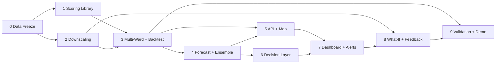

# Development Phases — Heat-Health Early Warning Platform

SIH 2026 · Problem Statement 26083 · Companion to [Heat_Health_Project_Proposal.md](../Heat_Health_Project_Proposal.md)

Each phase has its own file with goal, tasks (as checkboxes), inputs, deliverables, exit criteria, and risks. Section references (§) point to the proposal.

## Guiding principle

**Get one honest number right before building anything around it.** The scoring library comes first and is tested against a real past heatwave (Phase 3) before any UI is built. Every later phase — API, map, dashboard, simulator — calls the same library, so explanations can never drift from the scores.

## Phase overview

| Phase | Title | Effort | MVP? | Innovations |
|---|---|---|---|---|
| [0](phase-0-foundation-data-freeze.md) | Foundation & Data Freeze | M | ✅ | #1 (roof data), #5 (cooling points) |
| [1](phase-1-core-scoring-library.md) | Core Scoring Library | M | ✅ | #1 Indoor heat |
| [2](phase-2-urban-heat-downscaling.md) | Urban Heat Downscaling | M | ✅ | enables #3 |
| [3](phase-3-multi-ward-backtest.md) | Multi-Ward Scoring & Backtest | M | ✅ | — |
| [4](phase-4-forecast-ensemble.md) | Forecast & Ensemble Probabilities | M | ✅ | #2 Probabilistic alerts |
| [5](phase-5-api-gis-map.md) | API & GIS Map | L | ✅ | — |
| [6](phase-6-decision-layer.md) | Decision Layer | L | ✅ | #4 Safe work windows, #5 Cooling deserts |
| [7](phase-7-dashboard-alert-delivery.md) | Command Dashboard & Alert Delivery | M | ✅ | IVR voice alerts |
| [8](phase-8-whatif-feedback-loop.md) | What-If Simulator & Feedback Loop | M | ⚠️ partial | #3 What-if, #6 Health-worker loop |
| [9](phase-9-validation-polish-demo.md) | Validation, Polish & Demo | M | ✅ | Post-event report card |

**Effort:** S = a few days for one person · M = about a week for 1–2 people · L = 1–2 weeks for 2+ people.

**MVP cut line:** if time runs short, Phases 0–7 plus the what-if simulator from Phase 8 are the minimum demo. The health-worker loop can be shown as a working form with flags; post-season recalibration and IVR can be presented as roadmap.

## Dependencies



**Parallel work:** Phase 2 (geospatial) runs alongside Phase 1 (scoring). Frontend scaffolding for Phase 5 can start once Phase 1 fixes the output schema. Advisory translation for Phase 6 can start any time after Phase 0.

## Innovation → phase map

| Innovation | Data prepared | Logic built | Shown in UI |
|---|---|---|---|
| #1 Indoor heat (roof type) | Phase 0 | Phase 1 | Phase 5 |
| #2 Probabilistic alerts | — | Phase 4 | Phase 5 |
| #3 What-if simulator | Phase 2 (LST–NDVI fit) | Phase 8 | Phase 8 |
| #4 Safe work windows | — | Phase 6 | Phase 7 |
| #5 Cooling deserts | Phase 0 | Phase 6 | Phase 7 |
| #6 Health-worker loop | — | Phase 8 | Phase 8 |
| IVR voice alerts | — | Phase 7 | Phase 7 |
| Post-event report card | — | Phase 9 | Phase 9 |

## Proposed repository layout

```
heat/
├── config.yaml                # all weights, thresholds, category bands
├── data/
│   ├── raw/                   # downloaded sources (not committed if large)
│   └── processed/
│       ├── wards.geojson      # boundaries
│       └── wards.parquet      # one row per ward, all static attributes
├── heatrisk/                  # core library (pure functions)
│   ├── weather.py             # Open-Meteo / ERA5 / ensemble fetchers
│   ├── downscale.py           # ward-level adjustment
│   ├── thermal.py             # WBGT, UTCI, Heat Index
│   ├── indices.py             # HTSI incl. night, persistence, indoor
│   ├── vulnerability.py       # PVI
│   ├── risk.py                # MRI, HRI, alert levels
│   ├── explain.py             # factor contributions
│   ├── ensemble.py            # alert probabilities
│   ├── work_windows.py        # safe work schedules
│   ├── cooling.py             # access, cooling gap, site selection
│   ├── actions.py             # rules → recommendations, advisories
│   └── scenarios.py           # what-if re-runs
├── backtest/                  # ERA5 replay, sensitivity, report card
├── api/                       # FastAPI app + scheduler
├── frontend/                  # React + MapLibre
├── gee/                       # Earth Engine scripts
├── tests/
└── phases/                    # this folder
```
